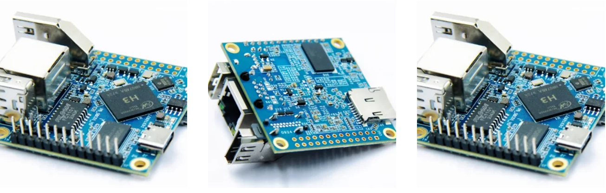

# PB-SBC01-H3-AND-Tg-bot
В процессе каждодневной загруженной паботы технической поддержки в наше компании, возникла потребнасть решать общие и часты вопросы быстрее, так нам и пришла идея  - создать легкого помощника для общения с клиентами, передача всей важной информации в одном клике в личном чате в телеграмме.

# PB_SBC01_H3 как платформа для телеграм-чат-бота

> Цель проекта — развернуть на одноплатном компьютере **PB_SBC01_H3** (нашей компании РВ Полярный Медведь Электронные технологии) постоянно работающий телеграм-бот для **общения с заказчиками**: быстрые ответы на частые вопросы, выдача ссылок на документацию/товары, сбор обратной связи, помощь с выбором и маршрут к техподдержке.


---

## Содержание

* [Почему эта плата под бота?](#почему-эта-плата-под-бота-?)
* [Функции бота для общения с заказчиками](#функции-бота-для-общения-с-заказчиками)
* [Подготовка хоста](#подготовка-хоста)

  * [Требования](#требования)
  * [Установка образа ОС](#установка-образа-ос)
  * [Первый вход и сеть](#первый-вход-и-сеть)
* [Установка Python и зависимостей](#установка-python-и-зависимостей)
* [Структура проекта](#структура-проекта)
* [Переменные окружения](#переменные-окружения)
* [Запуск вручную](#запуск-вручную)
* [Автозапуск через systemd](#автозапуск-через-systemd)
* [Код бота (Python, с комментариями)](#код-бота-python-с-комментариями)
* [Безопасность и эксплуатация](#безопасность-и-эксплуатация)
* [Диагностика и обслуживание](#диагностика-и-обслуживание)
* [Конец](#конец)


---

## Почему эта плата под бота?

**PB_SBC01_H3** — компактный одноплатный компьютер на SoC Allwinner H3, совместимый с Debian/Ubuntu. Он энергоэффективен, стабильно работает 24/7, имеет Ethernet/Wi-Fi и доступ к шинам GPIO/I²C/SPI/UART — если боту нужно читать датчики или управлять внешними устройствами. Отлично подходит как «малый сервер» для телеграм-бота, который должен быть всегда онлайн.


---

## Функции бота для общения с заказчиками

* **Мгновенные ответы** по кнопкам: контакты, частые вопросы, ссылки на документы и разделы сайта.
* **Коммуникация по заказам:** подсказки, что отправить менеджеру для проверки статуса.
* **Сбор обратной связи:** пользователь пишет отзыв, бот доставляет его ответственному (админу).
* **Помощь в выборе:** выводит указание связаться с техподдержкой/менеджером.
* **Новости и анонсы:** быстрая рассылка новостей через кнопку/команду.
* **Список продуктов:** структурированные ссылки (можно расширять из БД).

---

## Подготовка хоста

### Требования

* microSD ≥ 8 ГБ (Class 10)
* Питание 5 В/2 А (USB Type-C)
* Сеть: Ethernet (желательно) или Wi-Fi
* (Опционально) HDMI-экран и клавиатура на первый запуск

### Установка образа ОС

1. Запишите образ Debian/Ubuntu на microSD (`balenaEtcher`, `Rufus`, `dd`).
2. Вставьте карту в PB_SBC01_H3, подайте питание, дождитесь загрузки.

### Первый вход и сеть

* С экраном: войдите в систему и подключите Wi-Fi.
* Без экрана: подключите Ethernet — адрес выдаст DHCP.
* Подключение по SSH:

  ```bash
  ssh <user>@<IP_платы>
  ```
* После входа **смените пароль** и выполните базовые обновления:

  ```bash
  sudo apt update && sudo apt upgrade -y
  ```

---

## Установка Python и зависимостей

```bash
# Python и инструменты
sudo apt install -y python3 python3-venv python3-pip git

# Системный пользователь под бота (опционально)
sudo useradd -m -s /bin/bash pbuser || true
sudo -u pbuser mkdir -p /home/pbuser/{bot,logs}
sudo chown -R pbuser:pbuser /home/pbuser

# Виртуальное окружение и библиотека бота
sudo -u pbuser python3 -m venv /home/pbuser/venv
sudo -u pbuser /home/pbuser/venv/bin/pip install --upgrade pip
sudo -u pbuser /home/pbuser/venv/bin/pip install "python-telegram-bot==20.7"
```

---

## Структура проекта
* Это лишь примерное древо, Ваши идеи - Ваше воплощение
```text
/home/pbuser/
├─ bot/
│  ├─ bot.py           # Код бота (см. ниже)
│  └─ .env             # Внутри (токен, ID админа)
├─ venv/               # Виртуальное окружение Python
└─ logs/
   └─ bot.log
```

---

## Переменные окружения

Создайте `/home/pbuser/bot/.env`:

```ini
BOT_TOKEN=вставьте_сюда_токен_бота_от_BotFather
ADMIN_USER_ID=123456789
```

* `BOT_TOKEN` — токен от @BotFather.
* `ADMIN_USER_ID` — Telegram ID администратора, которому будут приходить отзывы.

---

## Запуск вручную

```bash
sudo -u pbuser -H bash -lc 'source ~/venv/bin/activate && python ~/bot/bot.py'
```

Остановить — `Ctrl+C`.

---

## Автозапуск через systemd

Создайте `/etc/systemd/system/bot.service`:

```ini
[Unit]
Description=Telegram bot on PB_SBC01_H3
After=network-online.target
Wants=network-online.target

[Service]
Type=simple
User=pbuser
WorkingDirectory=/home/pbuser/bot
Environment="VIRTUAL_ENV=/home/pbuser/venv"
Environment="PATH=/home/pbuser/venv/bin:/usr/local/sbin:/usr/local/bin:/usr/sbin:/usr/bin"
ExecStart=/home/pbuser/venv/bin/python /home/pbuser/bot/bot.py
Restart=always
RestartSec=3
StandardOutput=append:/home/pbuser/logs/bot.log
StandardError=append:/home/pbuser/logs/bot.log

[Install]
WantedBy=multi-user.target
```

Активируйте и проверьте:

```bash
sudo systemctl daemon-reload
sudo systemctl enable bot
sudo systemctl start bot

systemctl status bot
journalctl -u bot -e
```

---

## Код бота (Python)

> Бот использует библиотеку `python-telegram-bot` v20+ (асинхронная модель).
> Логика меню и кнопок ориентирована на сценарии общения с заказчиками: документы, контакты, FAQ, статус заказа, отзывы, помощь, форум, новости.

```python
# bot.py
# Телеграм-бот для PB_SBC01_H3: главное меню, кнопки и обработчики.
# Цели:
#   • Упростить коммуникацию с заказчиками (FAQ, ссылки, контакты).
#   • Собирать обратную связь (пересылка отзывов админу).
#   • Помогать с выбором (маршрут к поддержке/менеджеру).
# Требования:
#   • python-telegram-bot >= 20.0 (pip install python-telegram-bot==20.7)
#   • Переменные окружения в файле .env: BOT_TOKEN, ADMIN_USER_ID

import asyncio
import os
from dataclasses import dataclass
from typing import Dict, List

from telegram import (
    Update,
    InlineKeyboardButton,
    InlineKeyboardMarkup,
)
from telegram.ext import (
    ApplicationBuilder,
    CommandHandler,
    CallbackQueryHandler,
    MessageHandler,
    ContextTypes,
    filters,
)

# ---------- Загрузка .env без сторонних библиотек ----------
def load_env(path: str = ".env") -> None:
    """
    Простейшая загрузка переменных окружения из .env.
    Формат строк: KEY=VALUE, пустые строки/комментарии (#) игнорируются.
    """
    if not os.path.exists(path):
        return
    with open(path, "r", encoding="utf-8") as f:
        for line in f:
            s = line.strip()
            if not s or s.startswith("#") or "=" not in s:
                continue
            k, v = s.split("=", 1)
            os.environ.setdefault(k.strip(), v.strip())

# Подхватываем .env из директории скрипта
load_env(os.path.join(os.path.dirname(__file__), ".env"))

BOT_TOKEN = os.getenv("BOT_TOKEN", "")
ADMIN_USER_ID = int(os.getenv("ADMIN_USER_ID", "0") or 0)

# ---------- Контент и ссылки (упростите/замените под свой контент) ----------
DOC_LINK_EXAMPLE = "https://example.com/pb-mcu01-h503"  # пример ссылки на документацию
DOC_LINK_PASSWORD = "PBPARTY"                           # если нужно, можно убрать

CONTACTS_TEXT = (
    "Телефон: +7 921 740 06 33\n"
    "Почта: pbshop@pb-embedded.ru\n"
    "Канал: https://t.me/PBparty\n"
    "Техподдержка: @PBPOLAR"
)

FORUM_LINK = "https://pb-embedded.ru/forum#showmore4"
NEWS_TEXT = "Новая модель: PB-MCU-ESP32 (ESP32-S3, Wi-Fi, BT 5.0, SPI/I2C/UART/PWM/USB)."

# Список продуктов: отображаем кнопки и выдаём ссылки
PRODUCTS: Dict[str, str] = {
    "PB-MCU01-H503": DOC_LINK_EXAMPLE,
    "PB-MCU-ESP32": "https://example.com/pb-mcu-esp32-doc",
    "PB_SBC01_H3": "https://pb-embedded.ru/pb_sbc01_h3",
}

# Частые вопросы: ответ по клику
FAQ_ITEMS: Dict[str, str] = {
    "Как подключиться по SSH?": "Найдите IP платы и выполните ssh <user>@<IP>. Пароль смените командой passwd.",
    "Как включить автозапуск?": "Создайте unit systemd (см. README) и активируйте: sudo systemctl enable bot.",
    "Как обновить бота?": "git pull && sudo systemctl restart bot.",
}

# ---------- Разметка клавиатур (главное меню и подменю) ----------
def main_menu_kbd() -> InlineKeyboardMarkup:
    rows = [
        [
            InlineKeyboardButton("Ссылки на документацию", callback_data="doc_links"),
            InlineKeyboardButton("Контактная информация", callback_data="contacts"),
        ],
        [
            InlineKeyboardButton("Частые вопросы", callback_data="faq"),
            InlineKeyboardButton("Проверка статуса заказа", callback_data="order"),
        ],
        [
            InlineKeyboardButton("Оставить отзыв", callback_data="feedback"),
            InlineKeyboardButton("Список продуктов", callback_data="products"),
        ],
        [
            InlineKeyboardButton("Помощь в выборе", callback_data="assist"),
            InlineKeyboardButton("Форум разработчиков", callback_data="forum"),
        ],
        [InlineKeyboardButton("Новости компании", callback_data="news")],
    ]
    return InlineKeyboardMarkup(rows)

def back_menu() -> InlineKeyboardMarkup:
    return InlineKeyboardMarkup([[InlineKeyboardButton("↩️ К главному меню", callback_data="back")]])

def products_menu() -> InlineKeyboardMarkup:
    rows: List[List[InlineKeyboardButton]] = []
    row: List[InlineKeyboardButton] = []
    for i, (name, _) in enumerate(PRODUCTS.items(), start=1):
        row.append(InlineKeyboardButton(name, callback_data=f"prod:{name}"))
        if i % 2 == 0:
            rows.append(row); row = []
    if row:
        rows.append(row)
    rows.append([InlineKeyboardButton("↩️ К главному меню", callback_data="back")])
    return InlineKeyboardMarkup(rows)

def faq_menu() -> InlineKeyboardMarkup:
    rows: List[List[InlineKeyboardButton]] = []
    for q in FAQ_ITEMS.keys():
        rows.append([InlineKeyboardButton(q, callback_data=f"faq:{q}")])
    rows.append([InlineKeyboardButton("↩️ К главному меню", callback_data="back")])
    return InlineKeyboardMarkup(rows)

# ---------- Состояние для приёма отзывов ----------
@dataclass
class FeedbackState:
    awaiting_text: bool = False

# Простое хранилище состояний по пользователям
USER_STATE: Dict[int, FeedbackState] = {}

# ---------- Хэндлеры команд и нажатий ----------
async def start(update: Update, context: ContextTypes.DEFAULT_TYPE):
    """
    /start — первый вход: показываем главное меню.
    """
    await update.message.reply_text(
        "Привет! Я бот Полярного Медведя. Выберите действие:",
        reply_markup=main_menu_kbd()
    )

async def on_button(update: Update, context: ContextTypes.DEFAULT_TYPE):
    """
    Обработка нажатий на инлайн-кнопки.
    """
    query = update.callback_query
    await query.answer()
    data = query.data

    if data == "back":
        await query.edit_message_text("Главное меню:", reply_markup=main_menu_kbd())
        return

    if data == "doc_links":
        text = (
            "Пример документации к продуктам:\n"
            f"{DOC_LINK_EXAMPLE}\n"
            f"Пароль: {DOC_LINK_PASSWORD}"
        )
        await query.edit_message_text(text, reply_markup=back_menu())
        return

    if data == "contacts":
        await query.edit_message_text(CONTACTS_TEXT, reply_markup=back_menu())
        return

    if data == "faq":
        await query.edit_message_text("Какой вопрос вас интересует?", reply_markup=faq_menu())
        return

    if data.startswith("faq:"):
        q = data.split("faq:", 1)[1]
        ans = FAQ_ITEMS.get(q, "Ответ не найден.")
        await query.edit_message_text(f"❓ {q}\n\n💡 {ans}", reply_markup=faq_menu())
        return

    if data == "order":
        # Подсказки по статусу заказа + кнопка для перехода к контактам
        kbd = InlineKeyboardMarkup([
            [InlineKeyboardButton("Контактная информация", callback_data="contacts")],
            [InlineKeyboardButton("↩️ К главному меню", callback_data="back")],
        ])
        await query.edit_message_text(
            "Чтобы проверить статус заказа, отправьте менеджеру:\n"
            "• Наименование товара\n• Ваше имя\n• Контакты для связи\n\n"
            "Контакты — по кнопке ниже.",
            reply_markup=kbd
        )
        return

    if data == "feedback":
        # Просим пользователя отправить отзыв одним сообщением
        uid = query.from_user.id
        USER_STATE[uid] = FeedbackState(awaiting_text=True)
        await query.edit_message_text(
            "Напишите ваш отзыв одним сообщением. После отправки получите подтверждение.",
            reply_markup=back_menu()
        )
        return

    if data == "products":
        await query.edit_message_text("Список продуктов:", reply_markup=products_menu())
        return

    if data.startswith("prod:"):
        name = data.split("prod:", 1)[1]
        link = PRODUCTS.get(name, "Ссылка не найдена.")
        await query.edit_message_text(f"{name} — документация:\n{link}", reply_markup=products_menu())
        return

    if data == "assist":
        await query.edit_message_text(
            "Для подбора решения напишите в техподдержку: @PBPOLAR",
            reply_markup=back_menu()
        )
        return

    if data == "forum":
        await query.edit_message_text(f"Форум разработчиков: {FORUM_LINK}", reply_markup=back_menu())
        return

    if data == "news":
        await query.edit_message_text(NEWS_TEXT, reply_markup=back_menu())
        return

async def on_message(update: Update, context: ContextTypes.DEFAULT_TYPE):
    """
    Приём свободных сообщений. Если включён режим «ожидания отзыва», пересылаем админу.
    Иначе — показываем главное меню.
    """
    uid = update.effective_user.id
    st = USER_STATE.get(uid)

    # Если ждём отзыв — пересылаем админу и сбрасываем состояние
    if st and st.awaiting_text and update.message and update.message.text:
        text = update.message.text.strip()
        if ADMIN_USER_ID:
            try:
                await context.bot.send_message(
                    chat_id=ADMIN_USER_ID,
                    text=f"📩 Новый отзыв\n👤 Пользователь: {uid}\n💬 {text}",
                )
            except Exception:
                # Ошибки доставки админу игнорируем, чтобы не тревожить пользователя
                pass
        USER_STATE[uid] = FeedbackState(awaiting_text=False)
        await update.message.reply_text("Спасибо! Ваш отзыв отправлен. 🙌")
        await update.message.reply_text("Главное меню:", reply_markup=main_menu_kbd())
        return

    # Любой другой текст — просто показать главное меню
    await update.message.reply_text("Главное меню:", reply_markup=main_menu_kbd())

def main():
    """
    Точка входа: собираем Application, регистрируем хэндлеры и запускаем polling.
    """
    if not BOT_TOKEN:
        raise SystemExit("Не задан BOT_TOKEN (см. файл .env)")
    app = ApplicationBuilder().token(BOT_TOKEN).build()
    app.add_handler(CommandHandler("start", start))
    app.add_handler(CallbackQueryHandler(on_button))
    app.add_handler(MessageHandler(filters.TEXT & ~filters.COMMAND, on_message))
    app.run_polling(close_loop=False)

if __name__ == "__main__":
    asyncio.run(main())
```

---

## Безопасность и эксплуатация ( наши личные советы )

* Храните токен в `.env`, права доступа `0600`, владелец — пользователь бота.
* Ограничьте доступ к устройству по SSH (ключи, отключение пароля, брандмауэр).
* Логи бота пишите в файл (`StandardOutput=/StandardError=` в unit-файле), подключите ротацию (logrotate).
* Обновляйте ОС и зависимости: `apt update && apt upgrade`, `pip list --outdated`.
* Для webhook-режима используйте HTTPS (Nginx + сертификаты), но для простоты polling обычно достаточно.

---

## Диагностика и обслуживание

```bash
# Перезапуск службы
sudo systemctl restart bot

# Статус и последние записи журнала
systemctl status bot
journalctl -u bot -e

# Обновление кода и перезапуск
cd /home/pbuser/bot
git pull
sudo systemctl restart bot
```

---

## Конец

* Интеграция разработки прошла успешно, что упростило жизнь и работникам и заказчикам. Общение стало проще и легче, а главное - в разы быстрее.
* Желаем и Вам успехов в создании своего собственного цифрового помощника!

---
